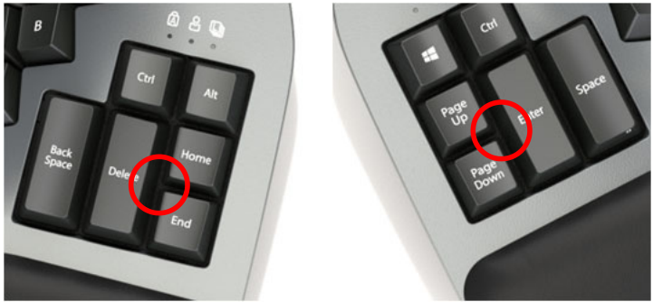

# Flashing firmware

Flashing puts one half of the keyboard into its bootloader, where it shows up
on your computer as a USB drive named `Adv360 Pro`, and copies one `.uf2` file
onto that drive. The half installs the file, ejects the drive itself and
reboots. Wait for the eject; macOS may then report that the disk wasn't
ejected properly, which is harmless. The half must be plugged in over USB, and
its keys do nothing while it is in the bootloader.

## Get the files

Every push to `V3.0` publishes a GitHub Release with `left.uf2` and
`right.uf2`, one per half, plus a `-clique` pair with ZMK Studio enabled. The
[README](../README.md#this-fork) explains how to fetch a release, or a
not-yet-merged build from a workflow run. Put the files in `firmware/`, where
git ignores them.

`settings-reset.uf2` in the repository root is a third file you only need when
changing firmware generation or recovering halves that stop syncing. See
[Flash a new firmware generation](#flash-a-new-firmware-generation).

## Enter the bootloader

There are two ways in. Both need the half plugged in over USB.

### With the keys

Hold Mod and press Hotkey 1 for the left half, or hold Mod and press Hotkey 3
for the right half. These are Kinesis's names for the keys; with blank keycaps,
find them by position:

- **Mod** is the top key of the right half's inner column, the column nearest
  the thumb keys, in line with the number row.
- **Hotkey 1** is the middle key of the left half's inner column, in the same
  row as Q.
- **Hotkey 3** is the middle key of the right half's inner column, in the same
  row as J.

The Mod layer in `config/colemak.keymap` keeps these on upstream's positions,
so the combos work on this layout and on Kinesis's factory firmware. They stop
working on a half whose settings have just been reset, because the reset image
has no keymap.

### With the reset button

Each half has a reset button on top, inside its thumb cluster. Press a
paperclip into the gap where the tall inner key meets the two small keys
stacked beside it: on the left half between Delete, Home and End in the
factory legends, on the right half between Enter, Page Up and Page Down. The
circles in the photo mark the spot.

Photo: Kinesis Advantage360 Pro user manual, section 2.7.

- **Double-press** the button, quickly, to enter the bootloader.
- **Single-press** it to leave the bootloader without flashing.

If the gap is hard to find, pull the three keycaps or use a flashlight. In this
layout the three keys around the left spot are Left Shift, Escape and Right
Ctrl, and around the right spot Enter, minus and Right Alt; see
[docs/colemak.md](colemak.md).

## Flash a keymap change

When the firmware generation doesn't change, which is every keymap edit, the
key combos are all you need and nothing has to be paired again.

1. Plug in the left half. Hold Mod and press Hotkey 1. The `Adv360 Pro` drive
   appears.
2. Copy the left firmware file to the drive and wait for it to eject.
3. Plug in the right half. Hold Mod and press Hotkey 3.
4. Copy the right firmware file to the drive and wait for it to eject.

The halves reconnect to each other and to your computer on their own.

## Flash a new firmware generation

When the ZMK branch in `config/west.yml` moves to a new Zephyr generation, or
when the halves stop syncing, reset both halves first. This follows section
7.2 of the manual. The keyboard is unusable between the reset and the new
firmware, so have another keyboard handy.

1. Plug in the left half, enter the bootloader, and copy `settings-reset.uf2`
   to the drive. Wait for the eject.
2. Plug in the right half and do the same.
3. Plug in the left half, double-press its reset button, and copy the left
   firmware file.
4. Plug in the right half, double-press its reset button, and copy the right
   firmware file.
5. Unplug everything and switch both halves off. Switch the left half on, then
   the right. They pair to each other within a few seconds.
6. Pair your computer again. Delete the keyboard's existing entry in the
   Bluetooth settings first, because the reset discarded the keys that pairing
   used, then connect to `Adv360 Pro` when it appears. USB to the left half
   works too.

## If something goes wrong

- **The halves don't sync after a reset.** Power-cycle the left half, then the
  right, in quick succession.
- **The right half's LEDs flash red.** It has lost the left half. Power-cycle
  both, left first.
- **A half is stuck in the bootloader.** Single-press its reset button, or
  power-cycle it.
- **A profile LED flashes slowly.** That profile is paired to a device that
  isn't in range. Hold Mod and press the number key for the profile you want,
  1 to 5 on the number row.
